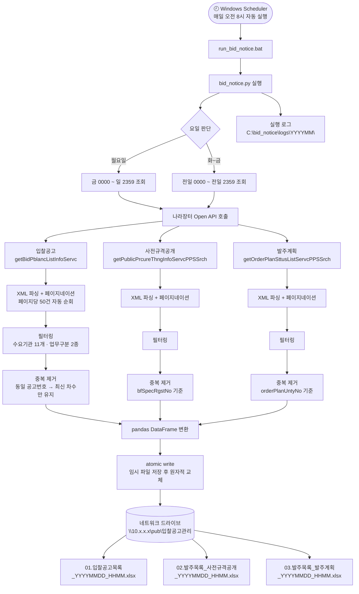
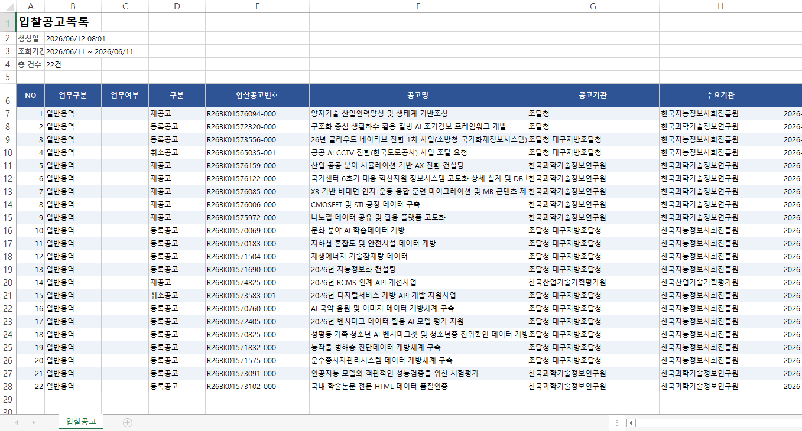
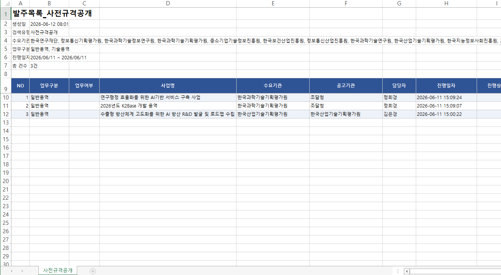
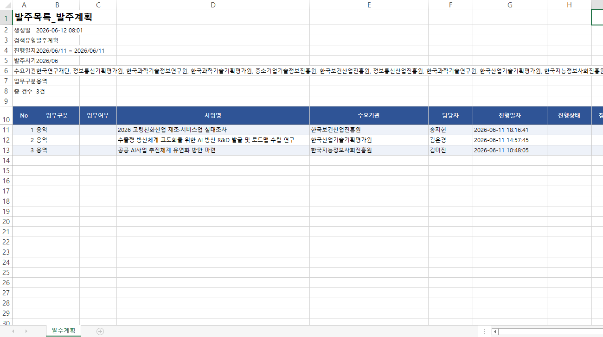
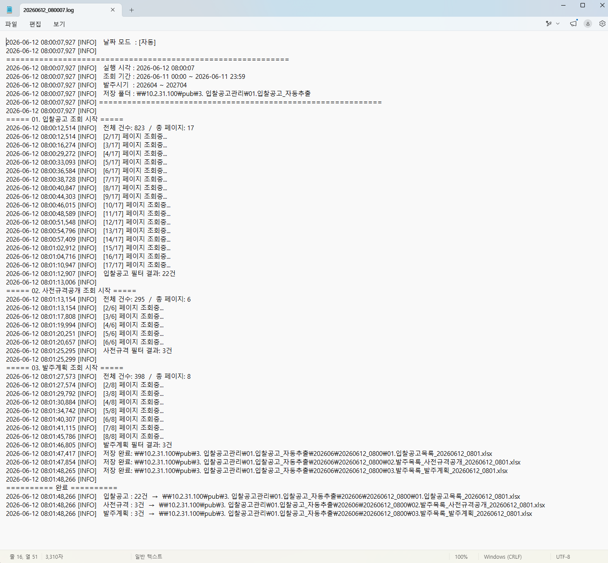

# 입찰공고 자동추출 시스템

나라장터 공공데이터 Open API를 활용해 **매일 오전 8시 자동으로** 11개 수요기관의 입찰공고·사전규격·발주계획 데이터를 수집하고 엑셀 파일로 저장하는 업무 자동화 도구입니다.


---

## 배경

기존에는 담당자가 나라장터 웹사이트에 직접 접속해 수동으로 공고를 조회하고 정리했습니다. 수요기관이 11개, 공고 유형이 3종이라 매일 반복 조회 작업이 필요했고, 누락이나 중복 발생 가능성도 있었습니다.

사용자 요청을 계기로 자동화 도구를 직접 기획·개발했고, 이후 리팩토링을 통해 코드 품질과 안정성을 개선했습니다.

---

## 시스템 흐름



---

## 출력 결과

> 📸 *스크린샷 위치: 생성된 엑셀 파일 캡처 및 실행 로그 캡처를 여기에 첨부*




매일 실행 후 아래 3개 파일이 지정 경로에 생성됩니다.

```
\\server\pub\입찰공고관리\01.입찰공고_자동추출\
└── 202506\
    └── 20250629_0800\
        ├── 01.입찰공고목록_20250629_0800.xlsx
        ├── 02.발주목록_사전규격공개_20250629_0800.xlsx
        └── 03.발주목록_발주계획_20250629_0800.xlsx
```

| 파일 | 수집 항목 |
|------|----------|
| 입찰공고 | 공고명, 수요기관, 게시일시, 마감일시, 계약방법, 낙찰방법, 예산금액 등 |
| 사전규격공개 | 사업명, 수요기관, 담당자, 진행일자, 예산금액 |
| 발주계획 | 사업명, 수요기관, 담당자, 발주시기, 예산금액 |

---

## 주요 구현 포인트

### 최신 차수 유지 로직
입찰공고는 변경·취소 시 동일 공고번호로 차수가 올라갑니다. 동일 `bidNtceNo`에 대해 가장 높은 `bidNtceOrd`(차수)만 남겨 항상 최신 상태를 반영합니다.

### atomic write로 파일 손상 방지
저장 중 프로세스 중단 시 불완전한 파일이 남는 문제를 방지합니다. 임시 파일에 완전히 쓴 뒤 `os.replace()`로 원자적 교체하며, 실패 시 임시 파일을 자동 삭제합니다.

```python
@contextmanager
def atomic_write(target_path: Path):
    tmp_fd, tmp_path = tempfile.mkstemp(suffix=".xlsx", dir=target_path.parent)
    os.close(tmp_fd)
    try:
        yield tmp_path
        os.replace(tmp_path, target_path)  # 성공 시 원자적 교체
    except Exception:
        Path(tmp_path).unlink(missing_ok=True)  # 실패 시 임시 파일 삭제
        raise
```

### 페이지네이션 최적화
기존 구현은 총 페이지 수 파악을 위해 1페이지를 먼저 호출한 뒤 루프에서 1페이지부터 다시 순회해 API를 2회 호출했습니다. 첫 응답을 즉시 재사용하고 루프를 2페이지부터 시작해 불필요한 호출을 제거했습니다.

### 데이터 유실 방지
중간 페이지 수집 실패 시 기존 코드는 조용히 넘어가 불완전한 데이터가 저장됐습니다. 변경 후에는 `RuntimeError`로 상위에 전파해 데이터 유실을 즉시 감지합니다.

### 설정값 외부화
API 키, 네트워크 경로 등 민감한 설정을 `.env`로 분리하고, `frozen=True` 데이터클래스로 불변 설정 객체를 구성했습니다.

---

## 리팩토링 전/후

초기 동작 버전(`v1`) 완성 후 코드 품질과 안정성을 전면 개선했습니다. 주요 변경 항목은 아래와 같습니다.

| 항목 | Before | After |
|------|--------|-------|
| API 키 관리 | 소스코드 하드코딩 | `.env` 분리 |
| 설정값 관리 | 전역 변수 분산 | `Config` 데이터클래스 통합 |
| 1페이지 API 호출 | 2회 중복 | 1회로 통합 |
| 중간 페이지 오류 | 조용히 무시 | `RuntimeError` 전파 |
| 파일 저장 방식 | 직접 덮어쓰기 | `atomic write` |
| 열 파싱 | `chr(ord(col) + 1)` — 두 자리 열 오작동 | `openpyxl` 공식 함수 |
| 빈 데이터 처리 | 빈 시트 그대로 저장 | "조회된 데이터 없음" 안내 |
| 로그 설정 | 모듈 import 시 즉시 실행 | `setup_logging()` 함수로 격리 |
| 경로 처리 | `os.path.join` | `pathlib.Path` |

전체 리팩토링 과정은 [리팩토링 회고](./리팩토링/리팩토링%20회고.md)에서 확인할 수 있습니다.

---

## 기술 스택

| 분류 | 라이브러리 | 용도 |
|------|----------|------|
| HTTP | `requests` + `urllib3` Retry | API 호출, 네트워크 오류 재시도 (최대 3회) |
| XML 파싱 | `xml.etree.ElementTree` | 나라장터 API 응답 파싱 |
| 데이터 처리 | `pandas` | DataFrame 변환 및 중복 제거 |
| 엑셀 생성 | `openpyxl` | 스타일링 포함 xlsx 생성 |
| 환경 변수 | `python-dotenv` | API 키, 경로 외부화 |
| 월 계산 | `python-dateutil` | `relativedelta` 기반 발주시기 계산 |
| 스케줄링 | Windows Task Scheduler | 매일 오전 8시 자동 실행 |

---

## 시작하기

### 1. 환경 변수 설정

```
# C:\bid_notice\.env
SERVICE_KEY=나라장터_API_서비스키
OUTPUT_DIR=\\서버경로\출력디렉토리
```

### 2. 패키지 설치

```bash
pip install requests pandas openpyxl python-dotenv python-dateutil
```

### 3. 실행

```bash
# 자동 실행 (Windows Scheduler에 run_bid_notice.bat 등록)
# 수동 실행
python bid_notice.py
```

수동으로 날짜 범위를 지정할 경우 스크립트 상단에서 아래와 같이 변경합니다.

```python
CFG = Config(manual_start="202506290000", manual_end="202506292359")
```

---

## 로그 예시



```
2026-05-29 08:00:01 [INFO] 실행 모드: 자동 | 조회 기간: 20260528 0000 ~ 20260528 2359
2026-05-29 08:00:03 [INFO]   입찰공고 : 42건  →  \\server\pub\...\01.입찰공고목록_20260529_0800.xlsx
2026-05-29 08:00:05 [INFO]   사전규격 : 17건  →  \\server\pub\...\02.발주목록_사전규격공개_20260529_0800.xlsx
2026-05-29 08:00:06 [INFO]   발주계획 : 8건   →  \\server\pub\...\03.발주목록_발주계획_20260529_0800.xlsx
```

---

## 파일 구조

```
bid_notice/
├── .env                    ← API 키 및 출력 경로 (gitignore)
├── .gitignore
├── bid_notice.py           ← 메인 실행 스크립트
├── run_bid_notice.bat      ← 작업 스케줄러 실행 배치 파일
└── logs/
    └── 202506/
        └── 20260529_080001.log
```